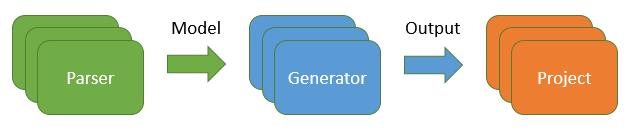

# srcgen4j

Source code generation for Java — a small, configuration-driven framework for building parse/generate pipelines.

[](https://github.com/fuinorg/srcgen4j/actions/workflows/maven.yml)
[](https://sonarcloud.io/dashboard?id=org.fuin.srcgen4j%3Asrcgen4j)
[](LICENSE)
[](https://openjdk.java.net/projects/jdk/21/)

## Overview

A model-driven approach almost always requires generating some code (model-to-text) or other
output. srcgen4j makes this easy: you wire up one or more **parsers** (that read input models)
and **generators** (that write output) in a single XML configuration, and run them as a pipeline
from a Maven build or programmatically.



## Modules

This repository is a multi-module Maven build. The artifacts keep their original coordinates
under the `org.fuin.srcgen4j` group:

| Module | Artifact | Description |
| ------ | -------- | ----------- |
| [commons](commons/) | `srcgen4j-commons` | Configuration model and common base classes for the parse/generate workflow. |
| [core](core/) | `srcgen4j-core` | Ready-to-use parsers and generators (EMF/Ecore, Apache Velocity, Xtext). |
| [maven](maven/) | `srcgen4j-maven-plugin` | Maven plugin that runs the pipeline during a build. |

Dependency direction: `commons` ← `core` ← `maven-plugin`.

See each module's README for configuration examples and usage details.

## Building

Requirements:
- **JDK 21** or later
- Maven — no local install needed, use the bundled [Maven Wrapper](https://maven.apache.org/wrapper/) (`./mvnw`)

Build the whole reactor (commons → core → maven-plugin) and run all tests:

```bash
./mvnw clean verify -s settings.xml
```

The provided `settings.xml` enables the snapshot repository needed for the `-SNAPSHOT`
dependencies; drop `-s settings.xml` once you build against released versions only.

## Using snapshots

Snapshot artifacts are published to the
[Central Portal Snapshots repository](https://central.sonatype.com/repository/maven-snapshots/).
To consume them, add the repository to your `~/.m2/settings.xml` (or project `pom.xml`):

```xml
<repository>
    <id>central.sonatype.snapshots</id>
    <name>Central Portal Snapshots</name>
    <url>https://central.sonatype.com/repository/maven-snapshots/</url>
    <releases>
        <enabled>false</enabled>
    </releases>
    <snapshots>
        <enabled>true</enabled>
    </snapshots>
</repository>
```

To use the **Maven plugin** as a snapshot, add the same entry to the `pluginRepositories` section:

```xml
<pluginRepository>
    <id>central.sonatype.snapshots</id>
    <name>Central Portal Snapshots</name>
    <url>https://central.sonatype.com/repository/maven-snapshots/</url>
    <releases>
        <enabled>false</enabled>
    </releases>
    <snapshots>
        <enabled>true</enabled>
    </snapshots>
</pluginRepository>
```

## Contributing

Bug reports and pull requests are welcome via [GitHub Issues](https://github.com/fuinorg/srcgen4j/issues).

## License

Licensed under the [GNU Lesser General Public License, version 2.1](LICENSE).
